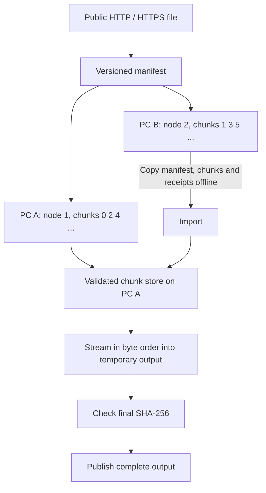

# Cohatch 0.1

For installation, every command, and a step-by-step two-PC transfer workflow,
read the [complete user handbook](docs/HANDBOOK.md).

Cohatch is an experimental Rust download manager for one or two PCs. Each PC
downloads assigned HTTP byte ranges concurrently. Copy the completed chunks
offline to one PC, import them, and reconstruct the original file.

Completed chunks are durable progress. Downloads and reconstructed outputs use
temporary files, exact length checks, SHA-256 integrity receipts, and safe
publication. The reusable library contains the engine; the CLI handles display.



Different network paths can add usable bandwidth. More connections sometimes
help overcome per-request latency or uneven throughput, but can also slow a
server down. The aspirational 100 GB/hour target is about 28 MB/s of payload;
it is not a promised speed. Total throughput is bounded by the local network,
VPN, route, remote host, disk, and remote service policy.

## Build on Windows

Install stable [Rust](https://www.rust-lang.org/tools/install), including the
Visual Studio C++ build tools and Windows SDK requested by the standard MSVC
installer. Open a new PowerShell terminal in this directory:

```powershell
cargo fmt --check
cargo clippy --all-targets -- -D warnings
cargo test --locked
cargo build --release --locked
.\target\release\cohatch.exe --help
```

The source uses Rust edition 2024. `Cargo.lock` pins the tested dependency set.
The library also uses portable APIs for future Linux/macOS frontends; the CI
workflow is configured for Windows and Linux. See [testing](docs/TESTING.md) for
verification commands, test coverage, and physical failure checks.

If this workspace contains the optional portable GNU toolchain under `.tools`,
load it before the commands above:

```powershell
. .\scripts\dev-env.ps1
```

That helper changes only the current PowerShell process environment. Normal
MSVC installations do not need it. Portable tools and build output are ignored
by version control. The final `cohatch.exe` can be copied to another PC.

## Two-PC walkthrough

These examples use `cohatch` on PATH; substitute the full executable path as
needed. Get the expected SHA-256 from a trusted publisher when available.

On PC A:

```powershell
cohatch create 'https://example.com/large.bin' --nodes 2 --chunk-size 64M --sha256 '<64-hex-digit-trusted-sha256>' --output-dir C:\Downloads\cohatch-job
cohatch inspect C:\Downloads\cohatch-job\manifest.json
cohatch download C:\Downloads\cohatch-job\manifest.json --node 1 --connections 32
```

Omit `--sha256` only if no trusted checksum exists and the source supplies a
usable HTTP validator. Without `--output-dir`, creation uses
`downloads/<download-id>`. Default node count is 1; `--nodes 2` sets up the two-PC
workflow. The default chunk size is 64 MiB. `64M`/`64MiB` are binary units;
`64MB` means 64,000,000 bytes. `--filename large.bin` overrides the safe basename.

Copy **the same manifest** to `C:\Downloads\cohatch-job\manifest.json` on PC B.
Do not independently recreate it or edit its node/layout fields. On PC B:

```powershell
cohatch download C:\Downloads\cohatch-job\manifest.json --node 2 --connections 32
cohatch status C:\Downloads\cohatch-job\manifest.json --node 2
```

Node numbering is one-based. With two nodes, node 1 receives indexes 0,2,4,...
and node 2 receives 1,3,5,... . With one node, node 1 receives every chunk.
Chunk count and active request count are independent. Concurrency is bounded
and configurable; 1,2,4,8,16,32,64,128 are all supported. The default is 8.

After PC B finishes, copy its **whole project directory**, including
`manifest.json`, `chunks/*.chunk`, and `chunks/*.chunk.json`, to an external SSD
or USB drive. Exit Cohatch before copying. Keep it separate from PC A's project
until import. Then on PC A, with no Internet connection required:

```powershell
cohatch import C:\Downloads\cohatch-job\manifest.json E:\cohatch-job
cohatch status C:\Downloads\cohatch-job\manifest.json --node 1
cohatch combine C:\Downloads\cohatch-job\manifest.json
cohatch verify C:\Downloads\cohatch-job\manifest.json
```

Import also accepts `E:\cohatch-job\chunks` if its parent contains the manifest.
It compares the full manifest and ID, validates receipt/index/length/hash,
skips identical chunks, rejects invalid candidates, and prints counts. A
rejection produces a nonzero exit code even if other candidates imported
successfully. Import copies files; it does not delete the source.

Combine reports all missing/corrupt indexes before reconstruction. Output is
placed beside the manifest, using the manifest filename. `--output other.bin`
selects another basename in that directory. Existing output files are never
overwritten; use `verify` for an existing result or select a different name.
Retain chunks until satisfied with your verified output.

After combining with `--output other.bin`, verify that name explicitly:
`cohatch verify C:\Downloads\cohatch-job\manifest.json --file other.bin`.
Without `--file`, verification uses the original manifest filename.

## Resume and integrity

Run the same download command again after a disconnect, timeout, process kill,
reboot, or Ctrl+C. The engine scans this node's assigned chunks and skips those
with valid receipts and matching length and SHA-256. This scan reads existing
chunks once; the live display does not rehash them. Fully complete nodes can
finish a resume run without contacting the source.

```text
cohatch-job/
  manifest.json
  .cohatch.lock
  chunks/
    00000000.chunk
    00000000.chunk.json
    00000002.chunk
    00000002.chunk.json
  large.bin                # appears only after successful combination
```

Chunks stream into unique `.tmp` files. Data and receipts are flushed before
the completion marker is published. A partial file or a chunk without its
receipt never counts as complete. Failed attempts are cleaned up where
possible; a hard kill can leave ignored temporary files. When no Cohatch
process is using the directory, stale `.cohatch-*.tmp` files may be removed to recover
space. Resume restarts incomplete chunks from their beginning.

Local chunk hashes detect later accidental damage. They do **not** authenticate
what the server sent. Only a final hash that matches a trusted expected SHA-256
is reported as **verified**. Without a trusted checksum, Cohatch computes and
prints the final SHA-256 and explicitly says authenticity is unverified.
Combine rechecks every chunk while copying, even after its preflight scan.
A mismatch prevents publication of the output.

`status` is a read-only snapshot. Run it while downloads/imports are idle for
stable counts; it may briefly show a chunk as missing while publication finishes.

## Supported sources

Use ordinary public HTTP/HTTPS URLs with a nonempty, known-size object and
working single byte ranges. Cohatch tests an actual `GET Range: bytes=0-0`;
an `Accept-Ranges` advertisement alone is insufficient. Every range must return
`206 Partial Content` with exact `Content-Range` coordinates and total size.
When present, Content-Length must match. Bodies must use identity encoding.
`200 OK`, malformed/missing ranges, and overlong or truncated data are rejected.

Strong ETag is preferred for `If-Range`; a valid Last-Modified date is the
fallback. Weak ETags alone are insufficient. Sources without either validator
require a trusted `--sha256`, so final reconstruction remains protected.
Timestamps have weaker consistency guarantees than strong ETags; a server
that reuses validators incorrectly cannot be detected reliably without a
trusted hash. Recorded validators must remain present and identical on every
chunk. The final redirect URL must also stay unchanged. HTTPS-to-HTTP
downgrades, embedded URL credentials, and unsafe redirect schemes are refused.

Source changes stop the download. Keep the old project intact and create a
new manifest in another directory; never try to repair identity metadata by
editing the old manifest. Signed/expiring URLs may require starting a new
project in v0.1. Cookie extraction and service-specific authentication are not
supported.

## Retries, progress, and logs

```powershell
cohatch download manifest.json --node 1 --connections 16 --retries 5 --backoff-ms 1000 --timeout-seconds 1800
cohatch download manifest.json --node 1 --verbose 2>cohatch-debug.log
```

Retries are additional attempts per chunk. Transient connection/body errors,
408, 429, and 5xx use bounded exponential backoff with jitter. Retry-After
supports seconds or HTTP dates; 429 and explicit Retry-After pause all workers'
next requests. In-flight responses may finish. Permanent HTTP and validation
errors stop the run. There is no IP/identity rotation or access-control bypass.

The default total request timeout is 30 minutes, with a 60-second maximum idle
read timeout and 15-second maximum connection timeout. Smaller total timeouts
also shorten those limits. Small chunks can reduce repeated work on very
unstable routes. Ctrl+C cancels requests, waits for already-started chunk
publication to finish, and returns exit code 130. Operational failures return
1; invalid command-line arguments return 2. Completed chunks remain available.

Interactive terminals show completed/remaining chunks and bytes, current and
average transfer rates, retries, and ETA, refreshed about once a second. Rates
include payload received in failed attempts; completed bytes include resumed
chunks. ETA is an estimate, especially during retries or the initial disk scan.
Normal summaries go to stdout; timestamped warnings/debug events go to stderr.
Verbose events include chunk indexes, HTTP statuses, retry counts, throughput,
and validation errors. Query tokens are omitted from HTTP errors and source
inspection. The manifest necessarily retains the full source URL; protect it
like any signed download link.

## Bounded concurrency benchmark

```powershell
cohatch benchmark 'https://example.com/large.bin'
cohatch benchmark 'https://example.com/large.bin' --connections 1,4,16,32 --sample-bytes 8M --seconds 5
```

The default samples 1,2,4,8,16,32,64 connections, with at most 8 MiB and
5 seconds per level, plus a one-byte source probe: at most about 56 MiB of
payload. Lower budgets are accepted. Each level stops when either cap is
reached; completed and partial payload contribute to measured transfer rate.
Range samples are small, so connection startup, caching, and request overhead
can dominate. Treat results as exploratory, not predicted large-file speed.
Benchmarking stops on HTTP errors, including rate limits, and never retries
them. It supports at most 128 connections, 16 levels, 64 MiB/level and
60 seconds/level to bound this diagnostic operation. Respect the host's terms.

## Troubleshooting and boundaries

| Symptom | Action |
|---|---|
| Server returned 200, wrong range, or encoded content | Use a source supporting strict byte ranges. |
| ETag/Last-Modified/redirect changed | Create a fresh manifest in a separate project. |
| No usable validator | Supply a trusted SHA-256 or use another source. |
| Resume initially appears idle | The disk scan is hashing previously completed chunks. |
| Missing/corrupt indexes | Resume the owning node or import its valid chunks and receipts. |
| Directory is in use | Finish the other Cohatch mutation first; OS locks release after exit. |
| Disk full | Free space and rerun. Completed chunks are retained; stale temps can be removed when idle. |
| SHA-256 mismatch | Output was not published. Confirm the trusted checksum and source; do not treat the data as verified. |
| More connections are slower / 429 | Reduce concurrency and allow server-requested cooldowns. |
| Output already exists | Run verify or choose a new output basename. |

Sequential combine needs space for both chunks and the reconstructed output,
roughly twice the file size on the combining PC, plus in-flight temporary data.
One-million-chunk and 1 GiB-per-chunk bounds prevent absurd manifests. Filenames
are sanitized, numeric ranges use checked arithmetic, and symlinks/junctions
are refused in store paths. Keep the project directory private: file locks
coordinate Cohatch processes but cannot sandbox a hostile local process that
replaces paths concurrently. Manifest IDs detect accidental edits and do not
act as signatures. File flushing depends on the OS/filesystem/device honoring
durability; Windows does not expose Unix-style directory fsync through Rust's
standard APIs.

v0.1 intentionally has no GUI, live PC coordination, automatic transfers,
partial-chunk resume, VPN management, mirrors, mobile app, or service-specific
source integrations. Core modules separate manifests, transport, scheduling,
storage, combine/verify, and benchmarking for future frontends.

See [manifest format](docs/manifest.md), [example manifest](examples/manifest.json),
[test coverage and failure checks](docs/TESTING.md), and the
[validation record](docs/VALIDATION.md) with 48 passing tests and matching
16 MiB and 1 GiB reconstruction hashes.
